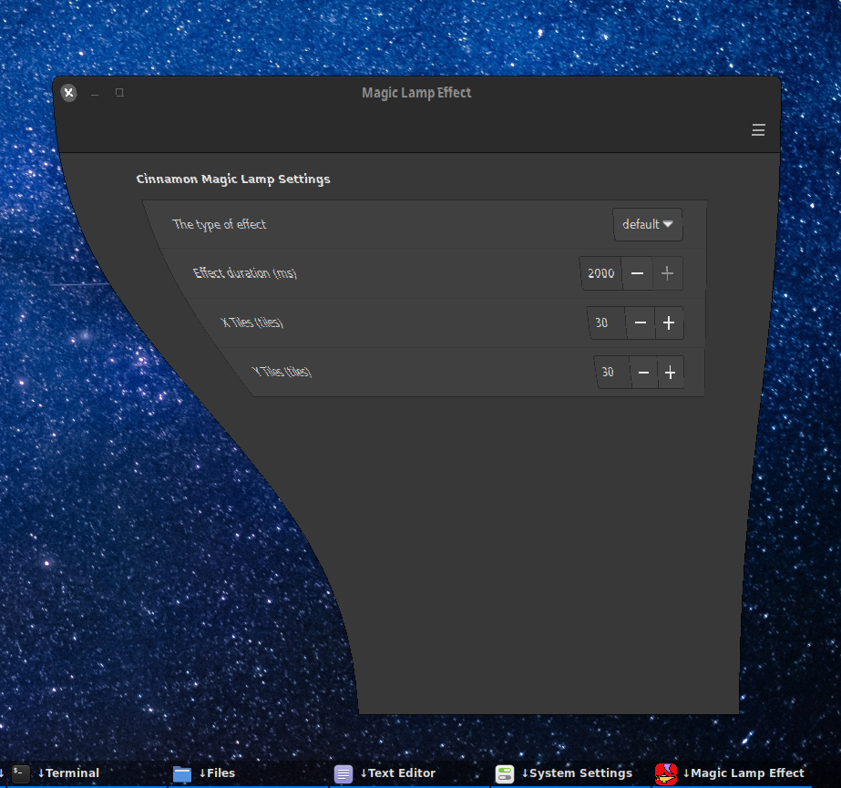

# CinnamonMagicLamp
A compiz like magic lamp effect for the Cinnamon desktop based on hermes83's Gnome extension (https://github.com/hermes83/compiz-alike-magic-lamp-effect)



This Cinnamon extension will create a compiz like Magic Lamp minimize and unminimize effect

## IMPORTANT

You must disable the Cinnamon Minimize and Unminimize effects as they will interfere with the operation of the Magic Lamp effect. Open the Menu->Preferences->Effects application and set the "New windows or unminimizing existing ones" and "Minimize windows" features to "None".

## Installation
At some point I will contribute this to cinnamon-spices so that you can use the "Extensions" tool from the cinnamon setting to get this extension, but for now you will need to following these instructions to install manually:

For the latest development version:
1. Clone the repo (or Download the latest repo by clinking on the green "code" button above then click "Download ZIP")
    ```
    git clone git@github.com:klangman/CinnamonMagicLamp.git
    ```
2. If you downloaded a ZIP, decompress the zip into a directory of your choice
    ```
    unzip ~/Downloads/CinnamonMagicLamp-main.zip
    ```
3. Change directory to the cloned repo or the decompressed ZIP file
4. Link the "CinnamonMagicLamp@klangman" directory into the "~/.local/share/cinnamon/extensions/" directory
    ```
    ln -s $PWD/CinnamonMagicLamp@klangman ~/.local/share/cinnamon/extensions/CinnamonMagicLamp@klangman
    ```
5. Open the Cinnamon Extensions application (Menu->Preferences->Extensions)
6. Select the "Magic Lap Effect" entry and then click the "+" button at the bottom of the Extensions window
8. Use the "gears" icon to open the CinnamonMagicLamp setting window and setup the preferred behaviour

## Feedback
Feel free to can create an issue here on Github to give me feedback or to report any issues you find.

If you like this extension, please star it so that more people might learn of it's existence.
Also, the more stars it gets the more encouragement I'll have to continue working on it.
Thanks!

Icon based on an icon by Nikita Golubev (https://www.flaticon.com/free-icon/magic-lamp_1065505)
